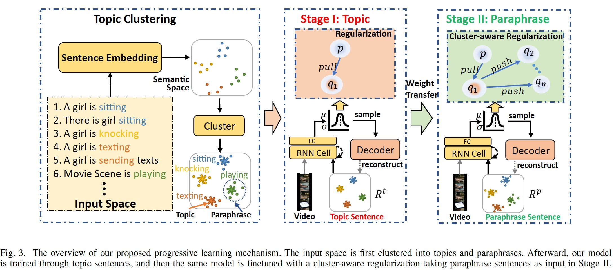

# STR

This is the code implementation of "**Show, Tell and Rephrase: Diverse Video Captioning via Two-Stage Progressive Training**" published in TMM.

## Introduction

This code provides the code implementation of the methods described in the article. We propose a novel progressive training method by decomposing the learning of latent variables into two stages that are topic-oriented and paraphrase-oriented, respectively. 




## Code Execution

The following steps explain how to run the code:

1. Install Dependencies: Ensure that the necessary dependencies are installed on your system

   ```bash
   python -m venv myenv (optional)
   source myenv/bin/activate (optional)
   pip install -r requirements.txt
   ```

2. Data Preparation: Prepare the dataset and place it in the specified path. (You can download from Tsinghua Cloud)

   * `datasets` directory: [MSVD](https://cloud.tsinghua.edu.cn/d/dc619471aef648c9b8bd/), [MSRVTT](https://cloud.tsinghua.edu.cn/d/403b51e239e04c13a23e/), VATEX etc.
   * `cococaption`: [cococaption](https://cloud.tsinghua.edu.cn/d/7195435155a34bfd9121/)

3. Configuration: Modify the parameters in the configuration file in the `configs` directory according to your needs.

4. Run the Code: Execute the command in `bash.sh` to run the code. (train or evaluate)

   NOTE: We release the optimal checkpoints for MSVD and MSRVTT in this onedrive link.  You can put them into the `results` directory.

After execution, the results will be saved in the specified output path (default is `results/`).

## Citation

If you use the code in your research, please cite the following article:

```
@article{liu2022show,
  title={Show, Tell and Rephrase: Diverse Video Captioning via Two-Stage Progressive Training},
  author={Liu, Zhu and Wang, Teng and Zhang, Jinrui and Zheng, Feng and Jiang, Wenhao and Lu, Ke},
  journal={IEEE Transactions on Multimedia},
  year={2022},
  publisher={IEEE}
}
```

## Acknowledgement

The code is based on [cos-vae](https://github.com/visinf/cos-cvae). We thank the authors for their work and code.

## License

This project is licensed under the [MIT License](LICENSE).